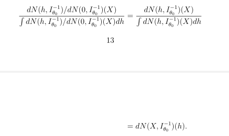

# Bayesian Statistics| Bernstein-von Mises Theorem 

在 non-Bayesian 视角下，当我们要对某参数模型的参数进行估计时，我们常常会运用 central limit theorem (CLT), 并得到一个类似这样的结果，

$$
\sqrt{n} (\hat{\theta}_n - \theta_0) \to N(0,\Sigma)
$$

in distribution. 在 Bayesian 视角下我们类似的结论，堪称是 Bayesian CLT, 这就是本文要介绍的 Bernstein-von Mises Theorem （BvM).

## 0. Notation

---

$I_\theta$: Fisher information,

$\ell_\theta(x) = \log p_\theta(x)$,

$\dot{\ell}_\theta(x) = \frac{d}{d \theta} \ell\_\theta(x)$,

$\ddot{\ell}_\theta(x) = \frac{d^2}{d\theta^2} \ell\_\theta(x)$,

$\Delta_{n,\theta} = 1/\sqrt{n} \sum_{i=1}^n \dot{\ell}_\theta(x_i)$,

$I_{n,\theta} = -1/n \sum_{i=1}^n \ddot{\ell}_\theta(x_i)$,

$||\cdot||_{TV}$: total variation,

---

## 1. Preliminaries

1. Bayes' formula
    By Bayes' formula, the posterior density of  $\vartheta$ is given by
    $$
    \begin{align*}
        \pi(\theta|X_1,...,X_n) = \frac{\prod_{i=1}^n p_\theta(X_i) \pi(\theta  )}{\int \prod_{i=1}^n p_\theta(X_i) \pi(\theta)d\theta}.
    \end{align*}
    $$

2. Taylor expansion
  $$
  \log \frac{p_{\theta+h}}{p_\theta} (x) = h^T \dot{\ell}_\theta(x) + \frac{1}{2} h^T \ddot{\ell}_\theta(x) h + o_p(||h||^2).
  $$

## 2. BvM

Theorem (BvM)
: Under some conditions,
$$
\begin{equation}
        \Vert \Pi(\sqrt{n}(\vartheta - \theta_0)\in \cdot| X_1,...,X_n) - N_d(I_{\theta_0}^{-1}\Delta_{n,\theta_0}, I_{\theta_0}^{-1}) \Vert _{TV}\to 0 \; \text{ in } P_{\theta_0}^n.
\end{equation}
$$
Here the sequence of  variables  $ \Delta_{n,\theta_0} $ converges under  $ \theta_0 $ in distribution to  $ N_d(0, I_{\theta_0}) $.

sketch pf proof
: step 1: Taylor expansion to apply CLT,

  
  Notice that $\Delta_{n,\theta} \to \Delta_\theta:=N(0, I_\theta)$ in distribution, and $I_{n,\theta}\to I_{\theta}$ in probability  by CLT.

  step 2: Rewrite the posterior.
  在第一步中我们看到，对log-likelihood进行泰勒展开，我们就可以运用CLT， 因此我们想对posterior进行泰勒展开
  
  现在，我们已经将posterior改写成了step 1中的形式，因此我们对其泰勒展开，其分子约等于$h^T\Delta_{n,\theta} +  \frac{1}{2} h^T I_{\theta,n}h$.

  step 3: Approximation posterior by Gaussian.
  另外,对于gaussian distribution, 通过计算可以得到
  
  将 $\Delta_\theta = I_\theta X$, 我们可以看到， $(P_{\theta+h/\sqrt{n}}) \to N(h,I_{\theta}^{-1})$， so the asymptotical behavior of the posterior can be represented in terms of $N(h,I_{\theta}^{-1})$ as 
  
  where $X\sim I_{\theta_0}^{-1} N(0,I_{\theta_0})$.
  $\Box$

## References

- [1] Van der Vaart, A. W. (2000). Asymptotic statistics.
- [2] Ghosal, S., & Van der Vaart, A. (2017). Fundamentals of nonparametric Bayesian inference